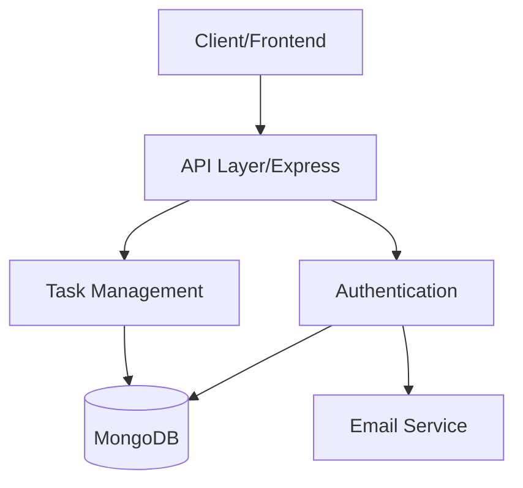

# Task Manager Backend

A robust backend service for a Task Management application built with Node.js, Express, and MongoDB. Features include user authentication, task management, and password reset functionality.

## 🏗 Architecture



### Core Components
- **API Layer**: Express.js RESTful API endpoints
- **Authentication**: JWT-based auth with password reset
- **Database**: MongoDB with Mongoose ODM
- **Email Service**: Nodemailer for password reset

## 🚀 Features

- User authentication (signup/login)
- JWT-based authorization
- CRUD operations for tasks
- Password reset via email
- Dynamic port allocation
- CORS enabled
- Environment-based configuration

## 📋 API Endpoints

### Authentication
```
POST /auth/signup    - Register new user
POST /auth/login     - User login
POST /auth/forgot-password  - Request password reset
POST /auth/reset-password   - Reset password with code
```

### Tasks
```
GET    /tasks       - Get all tasks
GET    /tasks/:id   - Get specific task
POST   /tasks       - Create new task
PUT    /tasks/:id   - Update task
DELETE /tasks/:id   - Delete task
```

## 🛠 Setup Instructions

1. **Clone the Repository**
```bash
git clone https://github.com/dakshbhardwaj/Task-manager-backend.git
cd Task-manager-backend
```

2. **Install Dependencies**
```bash
npm install
```

3. **Environment Configuration**
Create a `.env` file in the root directory:
```env
MONGO_URI=your_mongodb_connection_string
JWT_SECRET=your_jwt_secret_key
EMAIL_USER=your_gmail_address
EMAIL_PASS=your_gmail_app_password
PORT=5000
```

4. **Gmail Setup for Password Reset**
- Enable 2-Step Verification in Google Account
- Generate App Password:
  - Go to Google Account Security
  - Select App Passwords under 2-Step Verification
  - Generate password for email use

5. **Start the Server**
```bash
# Development mode
npm run dev

# Production mode
npm start
```

## 🏗 Project Structure
```
task-manager-backend/
├── config/
│   └── db.js           # Database configuration
├── middleware/
│   └── authMiddleware.js # JWT authentication middleware
├── models/
│   ├── User.js         # User model schema
│   └── Task.js         # Task model schema
├── routes/
│   ├── authRoutes.js   # Authentication routes
│   └── taskRoutes.js   # Task management routes
├── utils/
│   └── emailService.js  # Email service configuration
├── .env                # Environment variables
├── server.js           # Application entry point
└── package.json        # Project dependencies
```

## 💻 Technology Stack

- **Runtime**: Node.js
- **Framework**: Express.js
- **Database**: MongoDB
- **ODM**: Mongoose
- **Authentication**: JWT (jsonwebtoken)
- **Password Hashing**: bcryptjs
- **Email Service**: Nodemailer
- **Development**: Nodemon

## 🔒 Security Features

- Password hashing with bcrypt
- JWT-based authentication
- Protected routes with middleware
- Email verification for password reset
- Secure email service configuration
- Environment variable protection

## 📝 API Documentation

### Authentication Endpoints

#### Sign Up
```http
POST /auth/signup
Content-Type: application/json

{
  "name": "string",
  "email": "string",
  "password": "string"
}
```

#### Login
```http
POST /auth/login
Content-Type: application/json

{
  "email": "string",
  "password": "string"
}
```

#### Password Reset Request
```http
POST /auth/forgot-password
Content-Type: application/json

{
  "email": "string"
}
```

### Task Endpoints

#### Create Task
```http
POST /tasks
Authorization: Bearer {token}
Content-Type: application/json

{
  "title": "string",
  "description": "string"
}
```
